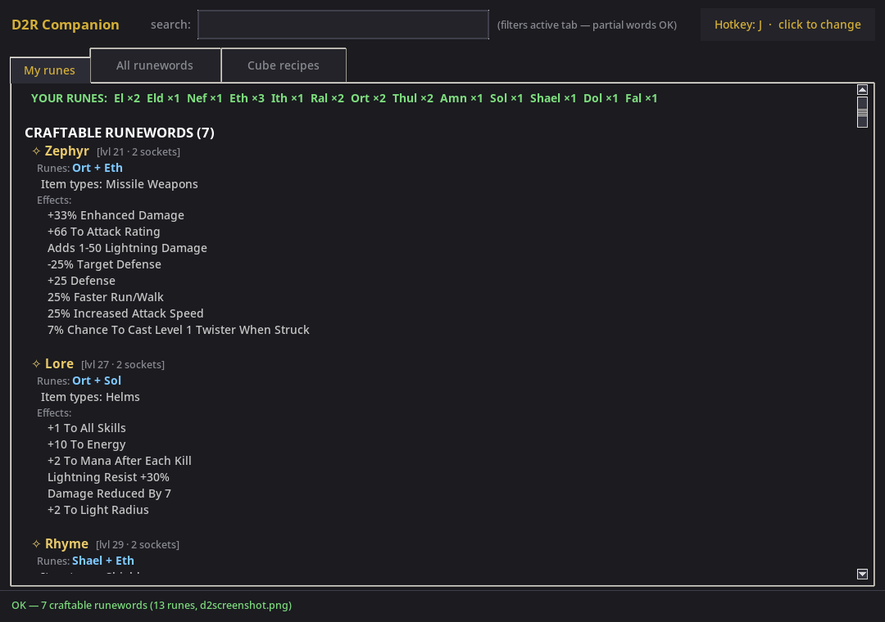

# D2R Companion

A dark-themed companion app for **Diablo 2: Resurrected** that reads your
rune stash straight from the screen and shows you exactly which runewords you
can craft right now — runes in the correct order, sockets, eligible item
types, and full effect descriptions. Plus the runewords you're **one rune
short** of, the complete runeword list by level, and all Horadric cube
recipes.



## Download

**Windows:** grab the latest **D2RCompanion-windows.zip** from
[Releases](https://github.com/MOEG-5/D2Rcompanion/releases), unzip and
double-click `D2RCompanion.exe`.

**Linux:** grab **D2RCompanion-linux.zip**, unzip and run
`D2RCompanion/D2RCompanion`. Built on Ubuntu 22.04, so it runs on most
modern distros (Ubuntu 22.04+, Fedora, Arch, …) with an X11 session.

Both zips are fully self-contained — no Python installation or other
dependencies required.

> **Windows SmartScreen warning:** the build is not code-signed (a certificate
> costs a few hundred $/year), so Windows may show *"Windows protected your
> PC"*. That is the normal state for free open-source software — click
> **More info → Run anyway**. Always download from this repository's Releases
> page.

On both platforms the app works the same: assign a hotkey, open the RUNES
tab in D2R, press the hotkey. Settings are stored in
`~/.config/d2r_runewords/config.json`
(`%USERPROFILE%\.config\d2r_runewords\config.json` on Windows).

## Features

- **My runes** — the default tab. After a scan it shows your runes, then
  every runeword you can craft (with its full effect list), then the ones
  missing a single rune (missing rune highlighted in red).
- **All runewords** — the complete list (100 runewords incl. 2.4/2.6/3.0
  additions) sorted by required level.
- **Cube recipes** — 159 Horadric cube recipes grouped by category
  (Socketing, Crafting, Rune/Gem upgrading, Item upgrading, Repair &
  recharge, Rerolling, Quest & special). All 36 crafting recipes list the
  properties they **always roll** (e.g. Crushing Blow on Blood Gloves) plus
  the random-affix behaviour.
- **Unique items** — every unique item (415) grouped by item category, with
  full stats (damage/defense, requirements, and the complete mod list).
- **Set items** — every set (34) with all member pieces and their stats,
  plus the **partial set bonus** list (per item-count threshold) and the
  **complete set bonus** for the full set.
- **Live search** — filters the active tab as you type; partial words match
  names, runes, item types, effect text, recipe ingredients and craft rolls.
- **Global hotkey** — press a key once and it's your scan key forever
  (remembered across runs). Press it in-game to re-scan instantly.
- **CLI** — the same scanning engine without the GUI.

## Quick start (GUI)

```bash
python3 d2rc.py
```

(Windows: run the downloaded `D2RCompanion.exe`; Linux: the bundled
`D2RCompanion/D2RCompanion` — see the download section above.)

1. On first run, click **Assign hotkey** and press the key you want to use
   for scanning (ESC, Enter, Tab, Space, Delete and modifier keys are
   refused so you don't steal important in-game buttons).
2. Open Diablo 2: Resurrected, open your stash on the **RUNES** tab.
3. Press your hotkey — the app screenshots the screen and lists what you
   can craft.

Pre-load a screenshot instead of scanning (useful for testing):

```bash
python3 d2rc.py --image screenshot.png
```

## CLI

```bash
python3 d2r_runewords.py --capture     # scan the screen right now
python3 d2r_runewords.py --image x.png # analyze an existing screenshot
python3 d2r_runewords.py --listen      # daemon: hotkey = capture + analyze
python3 d2r_runewords.py --list        # dump the runeword database
python3 d2r_runewords.py --image x.png --all   # also show "one rune short"
```

The `--listen` daemon uses the hotkey from the config file (set it via the
GUI, or add `"hotkey": "F8"` to `~/.config/d2r_runewords/config.json`).

## How it works

The D2R **RUNES** stash tab renders all 33 runes in a fixed 9×4 grid. Runes
you own show as light stone slabs with a white count digit; runes you don't
own show as dark placeholder silhouettes. The tool screenshots the screen
and checks the brightness of each of the 33 slots — bright slot = rune
present. Stack sizes are read from the count digit via embedded templates
(best effort; presence detection is the reliable part).

## Files

```
d2rc.py               GUI (main entry — python3 d2rc.py)
d2r_runewords.py      CLI + scanning core + hotkey grab (X11 + Windows)
d2r_data.py           runeword + cube recipe database (single source of truth)
d2r_items.py          all unique + set items with stats and set bonuses
                       (scraped from diablo2.io, incl. Reign of the Warlock)
d2r_companion.spec    PyInstaller spec — Windows + Linux builds (used by CI)
d2r.ico               app icon (Windows exe + taskbar)
version_info.txt      Windows exe version resource
screenshot.png        app UI screenshot (used in this README)
d2screenshot.png      calibration screenshot (slot layout)
```

## Requirements

Running from source needs Python 3 with Pillow, numpy and python-xlib.

- The game should run fullscreen (or borderless) on one monitor at the
  resolution used for calibration (1920×1080) — the layout auto-scales, and
  windowed/multi-monitor setups can be tuned via
  `~/.config/d2r_runewords/config.json` (`offset_x`/`offset_y`).
- Exclusive-fullscreen games sometimes render to an overlay the OS cannot
  capture (black image) — switch D2R to Windowed / Borderless Windowed.

Release builds are produced automatically by
[GitHub Actions](.github/workflows/build-release.yml): push a tag
(`git tag v0.1.3 && git push origin v0.1.3`) and both platform zips are
built and attached to a GitHub Release.

## Data source

Runeword + recipe data parsed from [diablo2.io](https://diablo2.io)
(D2R v3.2 / Reign of the Warlock, incl. Authority, Coven, Void, Vigilance,
Ritual, Hysteria, Mania). Unique and set items (stats + partial/complete set bonuses) also from
diablo2.io, covering every item up to the latest D2R patch (Reign of the
Warlock, including the new Grimoires). Craft-roll data from
[maxroll.gg](https://maxroll.gg/d2/items/crafted-items). Slot layout and
thresholds were calibrated from `d2screenshot.png`.

## License

[MIT](LICENSE)
